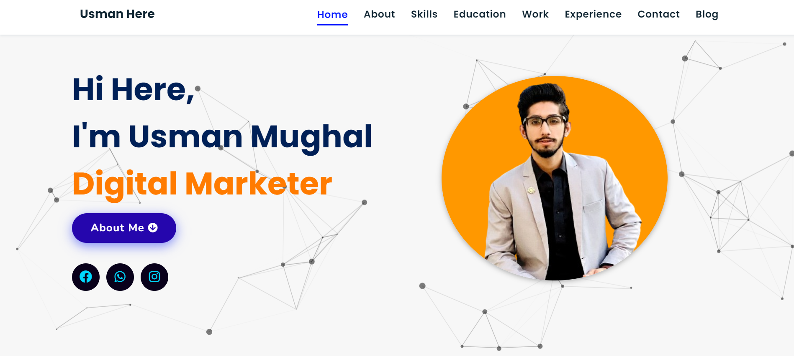

## Portfolio-Website
Portfolio website build using HTML5, CSS3, JavaScript.

<a href="https://usmanmughal.me/" target="_blank">**Visit Now** 🚀</a>

## 📌 Digital Marketing
&nbsp;
&nbsp;

### Extras : 
Particle.js, Typed.js, Tilt.js, Scroll Reveal, Tawk.to, Font Awesome and JSON

## 📌 Sneak Peek of Main Page 🙈 :

<h2>📬 Contact</h2>

If you want to contact me, you can reach me through below handles.

&nbsp;&nbsp;<a href="https://www.instagram.com/g._usman_here/?next=%2F"></img></a>

© 2024 Usman Mughal

